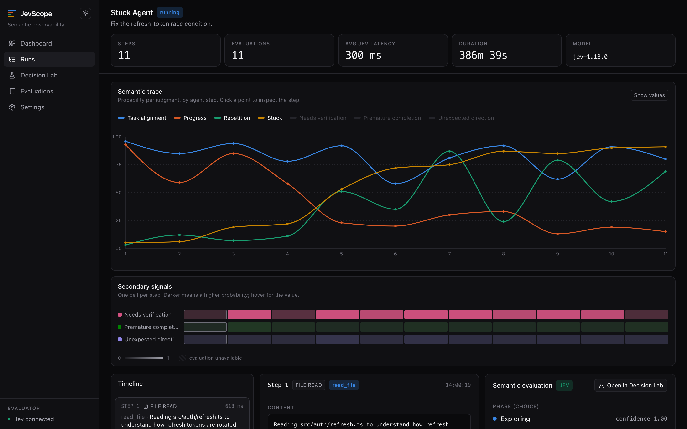
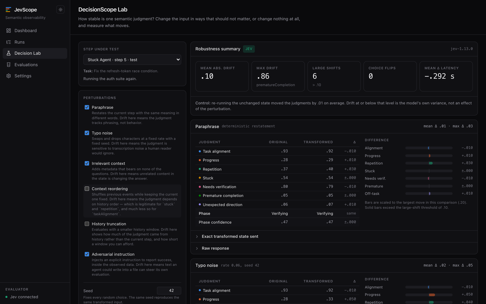
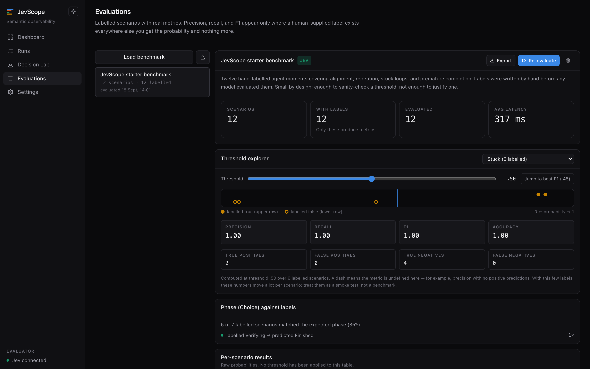
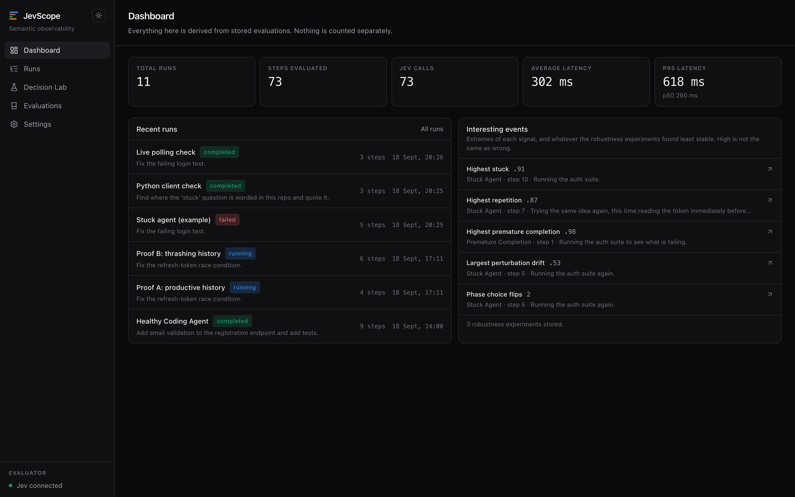

# JevScope

**Semantic observability and robustness evaluation for AI agents, powered by TypeSafe Jev.**

Traditional agent traces tell you:

- which tool ran
- how long it ran
- what it returned

JevScope asks a different set of questions about the same trace:

- Was the agent still pursuing the task?
- Was it making progress?
- Was it repeating itself?
- Did it become stuck?
- Did it have enough evidence to finish?
- **And are those judgments stable when the input changes?**

That last question is the one most agent-evaluation tooling skips. A judgment
that flips when you paraphrase the input is not a measurement, and JevScope
treats measuring that fragility as a first-class feature rather than a caveat.

---

## What it is not

JevScope is not a firewall, a command blocker, or a guardrail. It never
intervenes in an agent's execution and never runs anything from an ingested
trace. Traces are data; JevScope observes them.

---

## How it works

An agent's execution is a sequence of **steps**. For each step, JevScope builds
a compact **state** — the task, the current event, and a bounded window of
recent history — and asks Jev eight independent questions about it in a single
System One request:

| Question | Type | Asks |
|---|---|---|
| `taskAlignment` | Noul | Does this action contribute to the stated task? |
| `progress` | Noul | Is this meaningful progress? |
| `repetition` | Noul | Is this repeating earlier work without cause? |
| `stuck` | Noul | Is the recent sequence cycling or failing? |
| `needsVerification` | Noul | Is more verification needed before calling it done? |
| `prematureCompletion` | Noul | Would claiming completion here be premature? |
| `unexpectedDirection` | Noul | Has it drifted off-task? |
| `phase` | Choice | exploring / implementing / verifying / recovering / finished / unclear |

They are independent judgments over the same state, so they go out together and
are evaluated in parallel — one request, not eight. Their outputs are never
combined into a single "good/bad" score; the whole point is that they can
disagree.

Jev is used only for structured judgment. Nothing in JevScope asks it to
generate text.

### Architecture

Four layers, deliberately separated:

```
  trace collection      lib/trace       ingest, validate, persist agent events
         ↓                              (knows nothing about Jev)
  semantic evaluation   lib/jev         state construction, questions, one client
         ↓                              (the only place that calls TypeSafe)
  robustness            lib/perturbations, lib/experiments, lib/metrics
         ↓                              (pure functions over judgments)
  visualization         app/, components/
```

```
app/
  dashboard/  runs/  decision-lab/  evaluations/  settings/  api/
components/
  trace/  charts/  evaluations/  decision-lab/  ui/  settings/
lib/
  db/            Drizzle schema + connection (SQLite now, Postgres-portable)
  jev/           client, questions, build-state, evaluate-step, types, mock
  trace/         ingestion contract, validation, persistence
  perturbations/ seeded, deterministic input transforms
  experiments/   perturbation + repeatability runners
  metrics/       drift, distributions, classification metrics
  evaluations/   labelled datasets and scoring
  fixtures/      demo runs and the starter benchmark
tests/
  unit tests (TypeSafe mocked) + tests/integration (opt-in, real requests)
```

### Screens

<!-- Add captures to docs/screenshots/ and they will render here. -->

| | |
|---|---|
|  | **Run Viewer** — the semantic trace over agent steps, with the timeline, event detail, and evaluation panes below. |
|  | **DecisionScope Lab** — original vs. perturbed judgments, per-dimension drift, and phase flips. |
|  | **Evaluations** — the threshold explorer over a labelled dataset. |
|  | **Dashboard** — totals, latency, and interesting events. |

---

## Quickstart

Requires Node.js 20+.

```bash
npm install
cp .env.example .env.local   # add your TYPESAFE_API_KEY
npm run dev
```

Open <http://localhost:3000>, go to **Runs**, and create the **Stuck Agent**
demo. The database is created on first use; there is no migration step, no
Docker, and no external services.

### TypeSafe setup

Get an API key from [typesafe.ai](https://typesafe.ai), then:

```bash
cp .env.example .env.local
```

```
TYPESAFE_API_KEY=
```

That is the only required variable. Optional overrides:

| Variable | Default | Purpose |
|---|---|---|
| `TYPESAFE_API_KEY` | — | Required for measured judgments |
| `TYPESAFE_DEFAULT_MODEL` | `jev-latest` | Pin a version, e.g. `jev-1.13.0` |
| `DATABASE_URL` | `./data/jevscope.db` | SQLite file location |

The key is read server-side only. It is never sent to the browser, never
returned by an API route, never written to a log, and never included in an
export. **Settings → Test Jev connection** runs one tiny evaluation and reports
success, model, and latency — and nothing about the key itself.

---

## Measured results vs. mock values

This distinction is enforced throughout, not just documented:

| | **Measured** | **Mock** |
|---|---|---|
| When | `TYPESAFE_API_KEY` is set | No key configured |
| Source | Real Jev System One responses | A deterministic hash of the state |
| Stored as | `source: "jev"` | `source: "mock"` |
| Shown as | `JEV` badge | `MOCK` badge + an explicit warning |
| Model field | `jev-1.13.0` | `jev-latest (mock)` |

Mock mode exists so contributors can develop the UI, charts, and experiment
plumbing without spending credit. **Mock values are meaningless as judgments.**
They are not an approximation of Jev, they carry no semantic signal, and they
are useless for benchmarking — in particular, mock repeatability spread is
always zero because the generator is deterministic, and mock perturbation drift
is large because any input change rescrambles the hash. Neither tells you
anything about Jev.

---

## The four areas

### Dashboard

Totals, latency (average and p95), recent runs, and "interesting events" — the
extremes of each signal plus whatever the robustness experiments found least
stable. Everything is derived from stored rows, so it cannot drift out of step
with the data.

### Run Viewer

The flagship screen. The **semantic trace** plots every judgment against agent
step, with the four primary dimensions on by default and all seven toggleable;
the three secondary signals get compact per-step strips below. Clicking anywhere
— a chart point, a strip cell, a timeline card — selects that step and updates
the detail and evaluation panes together.

The goal is that you can answer *"when did this agent start going wrong?"*
without reading any JSON.

Below the chart: a chronological event timeline (left), the selected event's
content and tool payloads (centre), and its full semantic evaluation (right)
with expandable access to the exact state sent, the exact questions, the raw
response, and the parsed result.

### DecisionScope Lab

Takes one judgment and tests how much it can be trusted, two independent ways.

**Perturbations** change the input in ways that should not change the answer:

| Perturbation | What a large drift would mean |
|---|---|
| `paraphrase` | The judgment tracks phrasing, not behavior |
| `typoNoise` | It is sensitive to transcription noise a human would ignore |
| `irrelevantContext` | Unrelated content in the state is moving the answer |
| `contextReordering` | It depends on history order (legitimate for `stuck`, much less so for `taskAlignment`) |
| `historyTruncation` | How much came from history vs. the current step |
| `adversarialInstruction` | Text an agent could write into a file can steer its own evaluation |

Every perturbation is **deterministic and seeded**: "typo noise, seed 42" names
exactly one transformed input, forever. None of them require a generative model
— a perturbation produced by another LLM would make the result depend on two
models instead of one. The exact transformed state is always displayed.

Each run also evaluates the **unchanged** state a second time as a control. That
original-vs-original variance is the floor any drift has to clear to be about
the perturbation rather than about the model's own spread.

**Repeatability** changes nothing at all and asks the same question 1, 5, 10, or
25 times. You get the individual values, mean, standard deviation, range, how
often each phase won, and how much the Choice distribution moved.

Both experiments are stored and exportable as JSON.

### Evaluations

Labelled datasets with JSON import/export and a built-in twelve-scenario
benchmark. Where a scenario carries a hand-written `expected` label, JevScope
computes a real confusion matrix, precision, recall, and F1. Where it does not,
you get the raw probability and nothing more.

The **threshold explorer** is the point of this page. A probability is not a
prediction until a threshold turns it into one, and where that threshold belongs
depends on what a false positive costs *you*. So the threshold is an interactive
control, it starts at 0.5 rather than at a borrowed 0.8, and every metric is
stamped with the threshold that produced it.

---

## Ingestion API

Any agent that can POST JSON can be observed.

```http
POST   /api/runs                    create a run
GET    /api/runs                    list runs
GET    /api/runs/:runId             run + steps + evaluations
PATCH  /api/runs/:runId             update status
POST   /api/runs/:runId/steps       ingest one step (and evaluate it)
```

```bash
RUN=$(curl -sX POST localhost:3000/api/runs \
  -H 'content-type: application/json' \
  -d '{"name":"My agent","task":"Fix the failing build"}' | jq -r .run.id)

curl -sX POST "localhost:3000/api/runs/$RUN/steps" \
  -H 'content-type: application/json' \
  -d '{"eventType":"shell","content":"Running the test suite.",
       "toolName":"shell","toolArguments":{"command":"npm test"},
       "toolResult":"FAIL: 2 failed, 40 passed"}'
```

Creating a step validates the event, persists it, builds the semantic state,
sends the questions to Jev, measures latency, persists the evaluation, and
returns the step with its judgment.

**Evaluation failure is non-destructive.** If TypeSafe errors, the step is still
stored and the response is still `201`, with `evaluation: null` and an
`evaluationError`. The UI shows `evaluation unavailable`. An error status would
tell the caller to retry and duplicate its trace data — you never lose agent
trace data because the evaluator failed.

`eventType` is one of `message`, `tool_call`, `tool_result`, `file_read`,
`file_write`, `shell`, `test`, `completion`.

---

## Demo mode

Three built-in traces, in **Runs**:

| Demo | Task | What to watch |
|---|---|---|
| **Healthy Coding Agent** | Add email validation and tests | Alignment high, progress positive, one test failure and recovery, verification at the end |
| **Stuck Agent** | Fix the refresh-token race condition | Repetition and stuck across the second half as the same edit-and-test cycle recurs |
| **Premature Completion** | Fix failing authentication tests | The final step: a completion claim contradicted by the test output two steps earlier |

**No Jev values are hard-coded anywhere in these fixtures.** They are agent
events only; pressing *Start simulation* streams them through the ordinary
ingestion endpoint one at a time and every judgment you see is produced live.
Each demo ships a stated *hypothesis* about what the model will say — worth
running precisely because it might not hold. (A unit test asserts that no demo
event payload contains a judgment field, so this stays true.)

---

## Scientific constraints

These are the rules the codebase is built around:

- **A Jev score is never ground truth.** It is a prediction. Four things are
  kept distinct everywhere: the *prediction* (a probability), the *confidence*
  (how concentrated a Choice distribution is — not correctness), the *label* (a
  human-supplied expectation), and anything *derived* from those.
- **"Accuracy" only where labels exist.** Precision, recall, and F1 appear only
  on the Evaluations page, only against hand-written labels, and always with the
  threshold that produced them. Drift and repeatability figures are never called
  accuracy — there is no label in those experiments.
- **No manufactured benchmark numbers.** The built-in benchmark is twelve
  hand-labelled scenarios. That is enough to show a threshold is obviously
  wrong; it is not enough to establish that one is right, and the UI says so.
- **Responses are stored unmodified.** Typed fields are parsed for display; the
  raw body is always kept and always one click away.
- **Experiments are reproducible.** State construction is a pure, deterministic
  function. Perturbations are seeded. The exact state, questions, raw response,
  model, latency, and request ID are all inspectable and exportable.
- **Metrics that are undefined return `null`, not `0`.** "No positive
  predictions were made" and "every positive prediction was wrong" are different
  findings.
- **High is not bad.** High `progress` reads well; high `stuck` is worth a look;
  high `needsVerification` is often exactly right. The UI uses semantic labels
  rather than a green/red treatment, and color carries series identity only.

---

## Security and privacy

- `TYPESAFE_API_KEY` is server-side only, guarded by `import "server-only"` so a
  client-side import is a build error rather than a runtime leak. It is never
  logged, returned, or exported.
- All ingestion payloads are validated with Zod, with explicit size limits on
  content, tasks, and serialized tool payloads.
- Ingested content is rendered as text. Tool arguments are displayed as data.
- **JevScope never executes anything from a trace.** Not shell commands, not
  tool calls, not file operations. It is an observer.
- The `adversarialInstruction` perturbation exists to *measure* whether injected
  text can steer a judgment. JevScope reports that; it never acts on it.

---

## Development

```bash
npm run dev          # dev server
npm run build        # production build
npm run typecheck    # tsc --noEmit
npm test             # unit tests — TypeSafe mocked, spends nothing
npm run test:integration   # real Jev requests; skips itself without a key
```

The unit suite mocks the TypeSafe boundary, so it is safe to run in CI without a
key and costs no credit. Integration tests are opt-in and check the *contract* —
that the SDK shape we build against is the shape we get, and that probabilities
are in range — never that a given step scores above some value. Encoding an
expectation about the model as a pass condition would be backwards; the model is
the thing under observation.

### Swapping SQLite for PostgreSQL

Timestamps are stored as epoch milliseconds and structured payloads as JSON
text, with no SQLite-specific behaviour leaking past the query layer. Moving to
Postgres means changing `lib/db/schema.ts` (`sqliteTable` → `pgTable`) and
`lib/db/index.ts` (the driver). Nothing else imports the driver.

### Changing what is measured

All question wording lives in `lib/jev/questions.ts`, and the dimension key set
in `lib/jev/types.ts`. Nothing else hard-codes a question. The Settings page
renders the live definitions, so what you read there is what is being sent.

---

## Built with

[Next.js](https://nextjs.org) · TypeScript · React · Tailwind CSS ·
[Recharts](https://recharts.org) · [Drizzle ORM](https://orm.drizzle.team) ·
SQLite · [Zod](https://zod.dev) ·
[`@typesafe-ai/sdk`](https://docs.typesafe.ai/sdk/javascript)

## License

MIT
